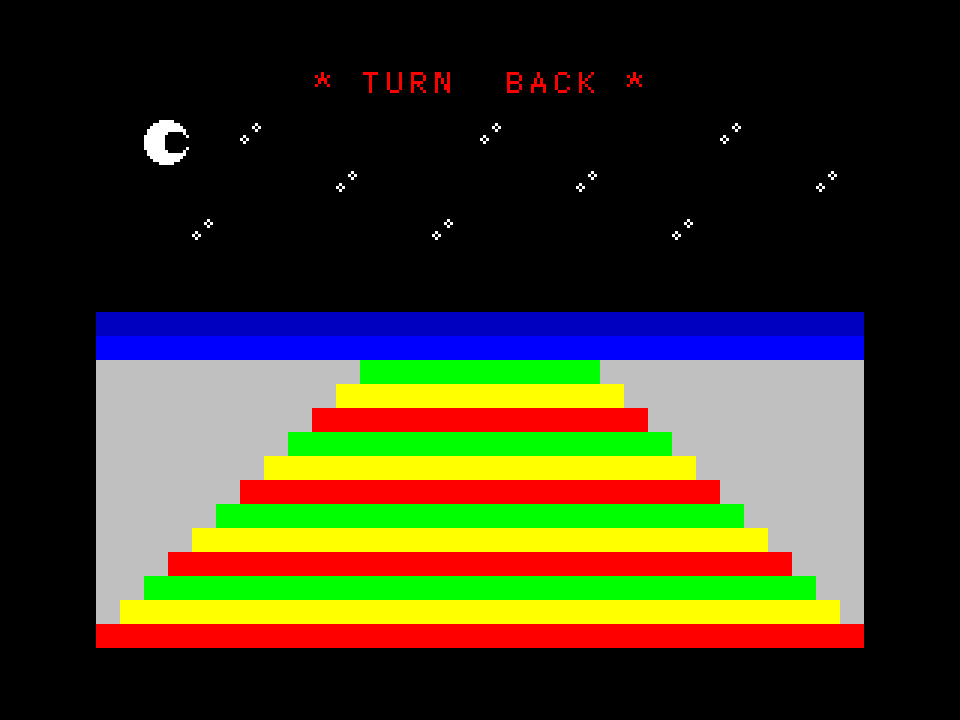

# DRIVING PAST THE DESTINATION

This is a little ZX Spectrum program for the 1st Formtober 2020 prompt "driving past the destination".
The project is set up to work with the [sjasmplus](https://github.com/z00m128/sjasmplus) compiler from within VSCode as a build task.

If you don't want to rebuild the code, you can use the compiled `main.sna` file in your emulator of choice (I use [Fuse](http://fuse-emulator.sourceforge.net)).

This project uses the [lib-spectrum](https://github.com/breakintoprogram/lib-spectrum) library by [breakintoprogram](https://github.com/breakintoprogram).
Parts of the code taken from [this Z80 tutorial](https://www.chibiakumas.com/z80/simplesamples.php#LessonS2).